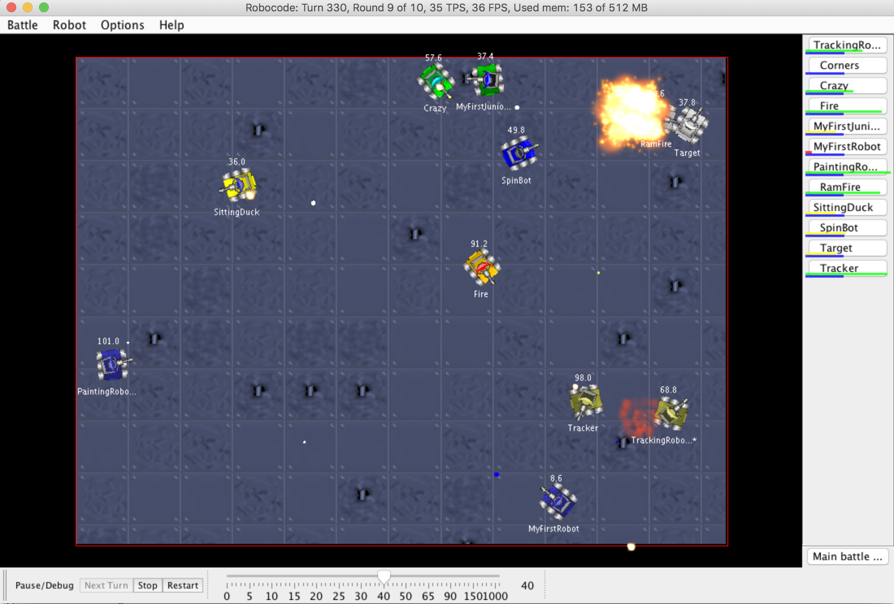
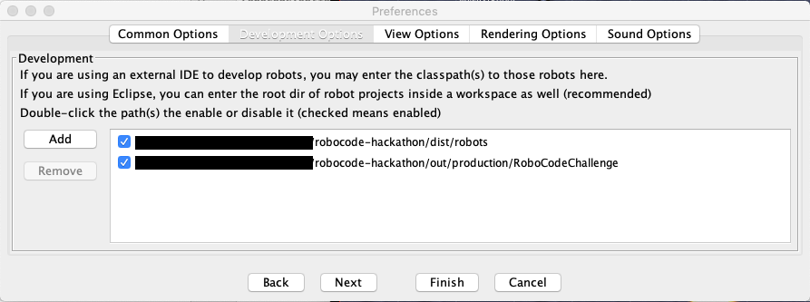

# Robocode Challenge
*Fast setup for a RoboCode hacking challenge in the Intellij IDE*

## Prerequisites

- Intellij IDEA
- Java 8 (tested with this version, maybe newer version works as well)
- Coffee

## Setup

1. Check out the repository
2. Make sure, that the Project SDK is configured correctly in Intellij under `File > Project Structure` (tested with Java 8)
3. Start "Robocode" from the run configurations
4. In the Robocode window go to `Options > Preferences > Development Options`
   and set the correct paths to the directories as in the picture below. Usually you need to remove all entries and re-add them:
    
5. Restart Robocode from IntelliJ
6. You are now ready to code!
7. Start coding your bot at `ch.zuehlke.bots.<your-team>`. You can find examples in the `bots` package.

## Further links and documentation
- Official site with further reading material: [https://robocode.sourceforge.io](https://robocode.sourceforge.io)
- Wiki: [http://robowiki.net/wiki/Robocode](http://robowiki.net/wiki/Robocode)
- Javadoc: [https://robocode.sourceforge.io/docs/robocode/](https://robocode.sourceforge.io/docs/robocode/)